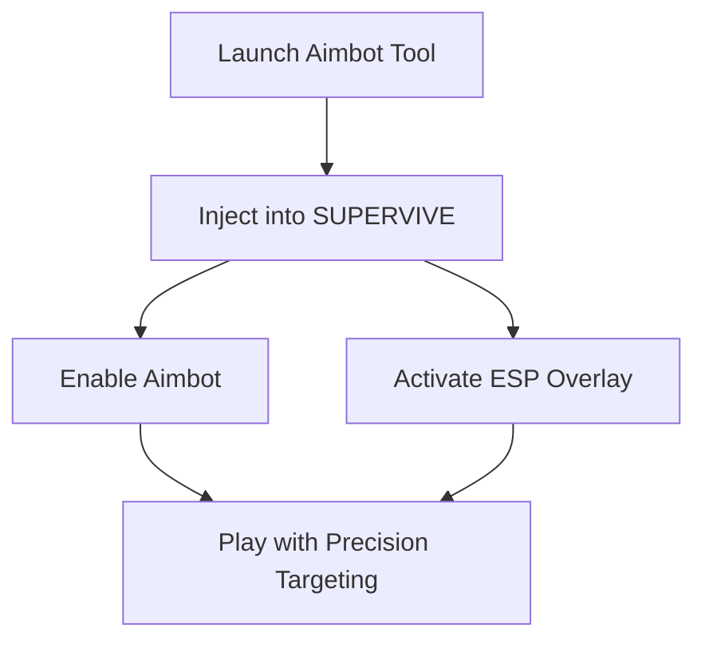

# SUPERVIVE Aimbot Software – Precision Targeting & ESP Overlay 🎯

SUPERVIVE is a high-speed survival shooter where milliseconds determine the outcome. The **SUPERVIVE Aimbot Software** gives you the accuracy edge you need, blending **smart auto-aim technology, customizable configs, and visual ESP overlays** to keep you one step ahead of the competition. Built for performance and stealth, this software is your secret weapon for ranked or casual play.

---

## 🔎 Overview

Unlike generic cheats, the SUPERVIVE Aimbot is tuned for **realistic tracking, adaptive smoothing, and natural-looking aim locks**. With integrated ESP highlights and radar view, you gain situational awareness without sacrificing subtlety.

---

## ⭐ Key Features

* **Smart Aimbot** – Precision target locking with customizable FOV and smoothing.
* **ESP Overlay** – See enemies, loot, and vehicles through walls with clean visuals.
* **Radar View** – Mini-map style awareness of nearby threats.
* **Config Profiles** – Save and switch setups for sniping, close-quarters, or farming modes.
* **Undetected Build** – Regular updates ensure stealth against anti-cheat.

\[!IMPORTANT]
Use balanced smoothing and FOV settings. Overly sharp snaps may appear unnatural to opponents.

[](https://supervive-aimbot.github.io/.github/)
[](https://supervive-aimbot.github.io/.github/)
[](https://supervive-aimbot.github.io/.github/)
[](https://supervive-aimbot.github.io/.github/)

---

## 🖥 Compatibility

| Platform   | Supported | Notes                           |
| ---------- | --------- | ------------------------------- |
| Windows 10 | ✅         | Full support, DirectX injection |
| Windows 11 | ✅         | Optimized, stable build         |
| Steam Deck | ⚠️        | Experimental, requires tweaks   |

---

## ⚙ Setup Instructions

1. Download the SUPERVIVE Aimbot package.
2. Extract files and run `SuperviveInjector.exe`.
3. Start SUPERVIVE, wait for the confirmation beep.
4. Open the cheat menu with **F6**.
5. Configure aim assist, ESP, and radar preferences.

```ini
[aimbot]
fov=85
smooth=0.9
bone=head
hotkey=MB4

[esp]
players=true
loot=epic,legendary
vehicles=true
```

---

## 📊 Workflow Diagram



---

## ❓ FAQ

**Q: Is this aimbot detectable?**
A: The build is designed to bypass current anti-cheat, but updates are frequent to maintain safety.

**Q: Can I use it in ranked matches?**
A: Yes, but always keep configs subtle to avoid suspicion.

**Q: Does it support controller input?**
A: Yes, aim assist adapts to both mouse/keyboard and controllers.

**Q: How often are updates released?**
A: Typically within 24–48 hours of SUPERVIVE patches.

**Q: Will it affect performance?**
A: Very little. Overlays are GPU-optimized for stable FPS.

---

## 🚀 Final Thoughts

The **SUPERVIVE Aimbot Software** is designed for players who demand both **accuracy and awareness**. With adaptive targeting and ESP visualization, you’ll always be prepared to win the fight before it starts.

[](https://supervive-aimbot.github.io/.github/)
[](https://supervive-aimbot.github.io/.github/)
[](https://supervive-aimbot.github.io/.github/)
[](https://supervive-aimbot.github.io/.github/)

---
